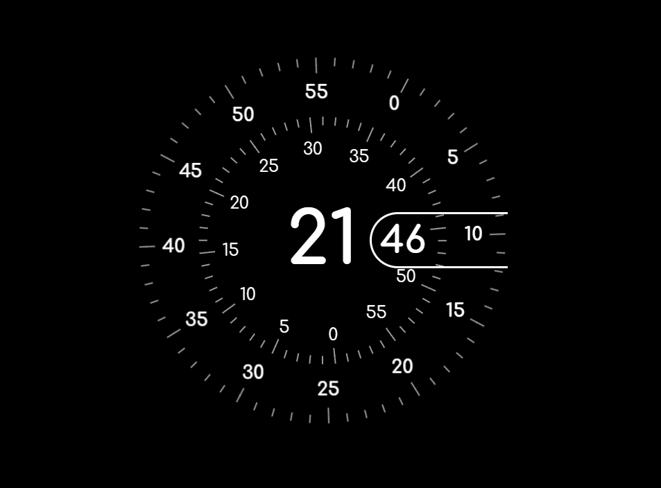

[](https://github.com/neonite2217)
[](https://github.com/neonite2217?tab=repositories)

# Analog Clock

## 🛠️ Description

The **Analog Clock** is a simple yet functional project that shows a scifi approach to traditional analog clock.

## ⚙️ Languages or Frameworks Used

<ul>
    <li>HTML5</li>
    <li>CSS3</li>
    <li>JavaScript</li>
</ul>

## 🌟 How to run the project

Follow these simple steps to run the Analog Clock project locally:

1. Clone the repository:

```sh
git clone https://github.com/neonite2217/Web_Dev-2.0.git
```

2. Navigate to the project directory:

```sh
cd Analog-Clock
```

3. Open the `index.html` file in your browser to see the analog clock in action.

## ⏰ Demo
<p align="center">


## 🤖 Author

[Biswaketan](https://github.com/neonite2217/)
