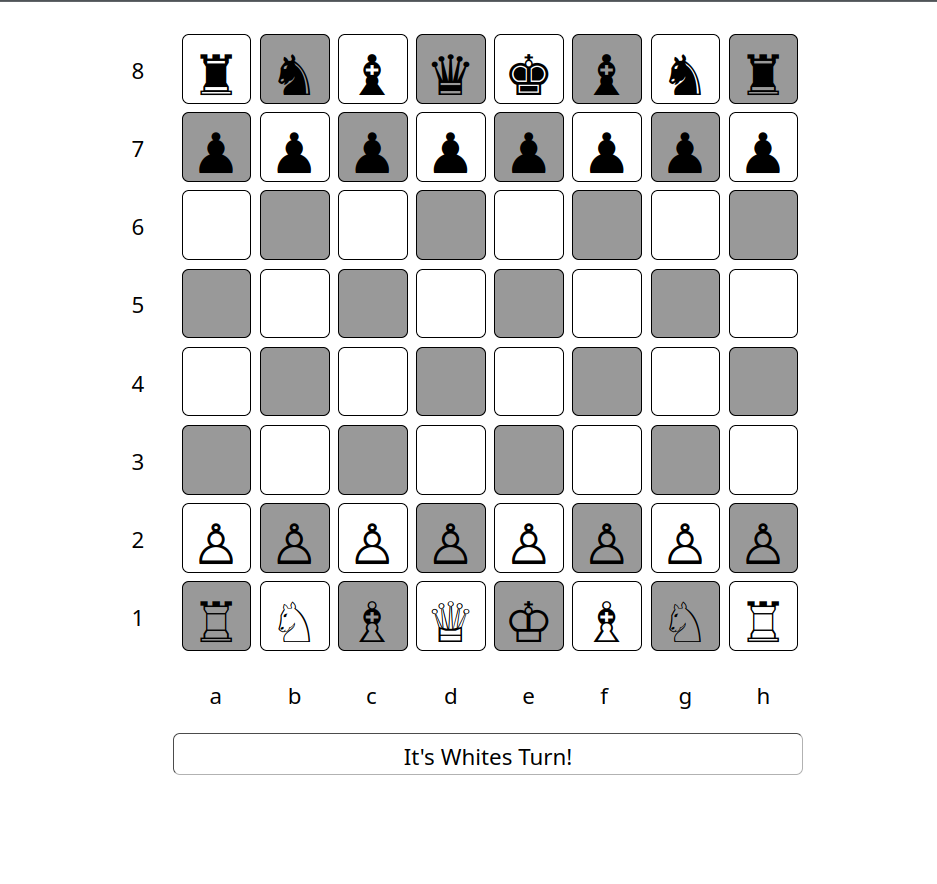

[](https://github.com/neonite2217)
[](https://github.com/neonite2217?tab=repositories)

# Chess Game

## 🛠️ Description

A Chess Game written in HTML, CSS and JAVASCRIPT

## ⚙️ Languages or Frameworks Used
<ul>
    <li>HTML5</li>
    <li>CSS3</li>
    <li>JavaScript</li>
</ul>

## 🌟 How to run the script
Running this game is easy.
Clone the Repository

```sh
git clone https://github.com/neonite2217/Web_Dev-2.0.git
```
- Navigate to the directory
- Run the index.html
- Start Playing!!!

## 📺 Demo
<p align="center">

view live demo

## 🤖 Author
[Biswaketan](https://github.com/neonite2217/)
