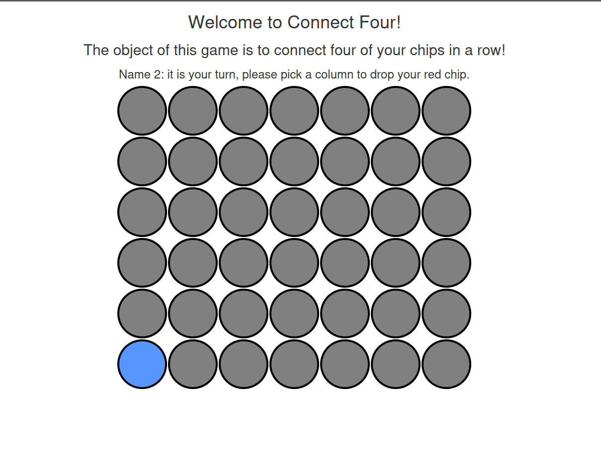

[](https://github.com/neonite2217)
[](https://github.com/neonite2217?tab=repositories)

# Connect Four
## Overview
- This is a simple game which can be played between two players.The player who connects the four bubbles first wins the game . The bubbles could be connected horizontally , vertically or diagonally.The players have to be together since multiplayer feature is not available .

## ⚙️ Languages or Frameworks Used
<ul>
    <li>HTML</li>
    <li>CSS</li>
    <li>Javascript</li>
    <li>JQuery</li>
</ul>

### Installation
Running this game is easy.
Clone the Repository

```sh
git clone https://github.com/neonite2217/Web_Dev-2.0.git
```

Navigate to the project directory and run `index.html` file in your web browser

## 📺 Demo
<p align="center">


## 🤖 Author
[Biswaketan](https://github.com/neonite2217/)
