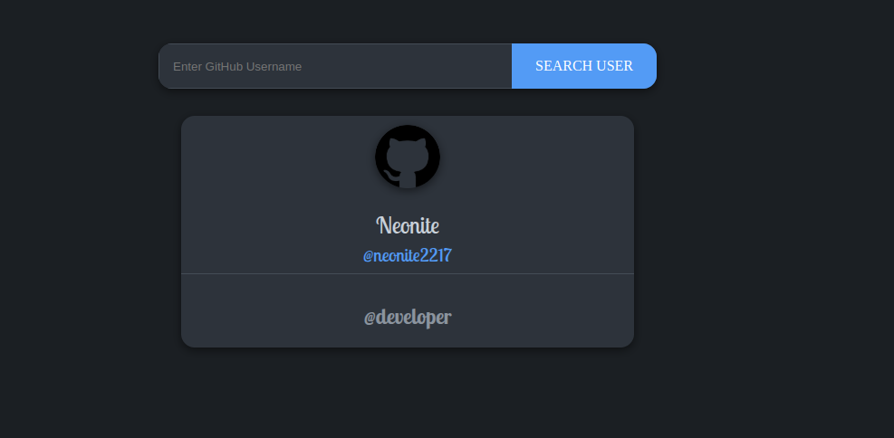

[](https://github.com/neonite2217)
[](https://github.com/neonite2217?tab=repositories)

# GitHub Profile Finder

## 🛠️ Description

The **GitHub Profile Finder** is a simple web application that allows users to search for GitHub profiles using a username. The application fetches profile information from the **GitHub API** and displays key details like the user's name, bio, repositories, followers, and more.

This tool is designed for users to quickly view GitHub profiles without having to manually search through the GitHub website.

## ⚙️ Technologies Used

This project utilizes the following technologies:

- **JavaScript Promises** for handling asynchronous operations and API requests.
- **API Integration** to fetch user data from GitHub's public API.

## 🌐 API Used

This project uses the [GitHub API](https://api.github.com/user/{user_name}) to retrieve public profile information from GitHub. The API endpoint `https://api.github.com/users/{user_name}` provides data about a user's repositories, followers, and other details.

## 🌟 Features

- **Search GitHub Users**: Enter any GitHub username to view their profile information.
- **Profile Display**: Displays user details including their avatar, repositories, followers, and more.
- **Error Handling**: If a user is not found or the username is incorrect, the app will show a friendly error message.

## 📺 Demo
<p align="center">


## 🚀 How to Run the Project Locally

Follow these steps to run the project on your local machine:

1. Clone the repository to your local machine:

```bash
git clone https://github.com/neonite2217/github-profile-finder.git
```

2. Navigate to the project directory:

```bash
cd github-profile-finder
```

3. Open the `index.html` file in your browser to start using the profile finder.

## 💻 Example Usage

1. Open the app in your browser.
2. Enter a GitHub username .
3. The profile information will be fetched from the GitHub API and displayed on the page.

## 🤖 Author

This project is made by [Biswaketan](https://github.com/neonite2217/).

## 💬 License

This project is licensed under the [MIT License](LICENSE). See the LICENSE file for more details.
