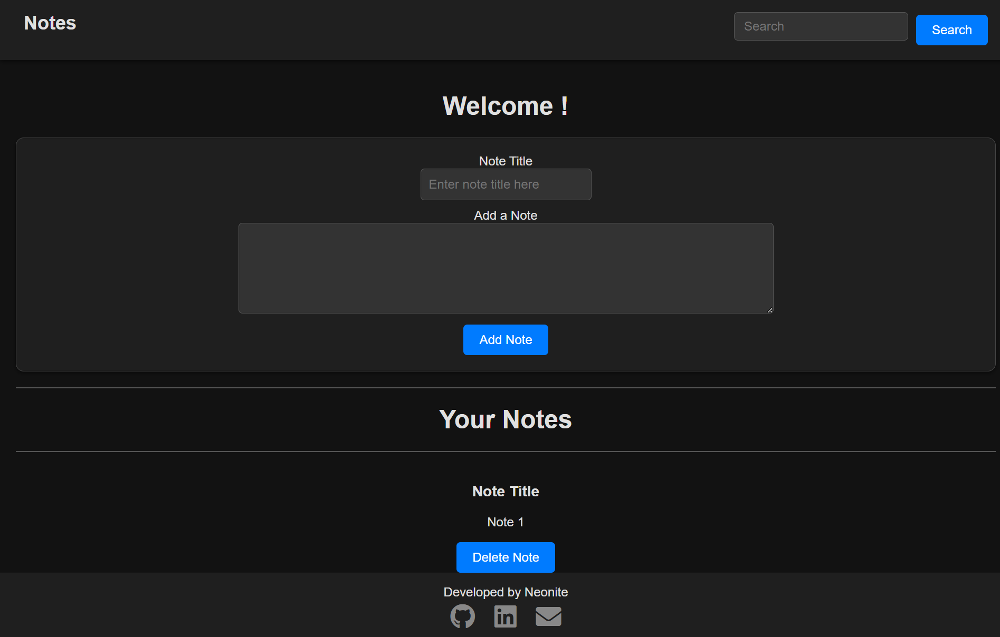

[](https://github.com/neonite2217)
[](https://github.com/neonite2217?tab=repositories)

# Notes Website

## 🛠️ Description

The **Notes Website** is a simple web application that allows users to create, store, and view notes. It stores all the notes in a JSON file, making it easy to persist the notes even after the user closes or reloads the page. When the user reopens the app, the saved notes are loaded and displayed automatically.

This app is ideal for users who need a quick and efficient way to write down and organize their thoughts, tasks, or ideas.

## ⚙️ Technologies Used

This project utilizes the following technologies:

- **HTML5** for the structure of the webpage.
- **CSS3** for styling and layout.
- **JavaScript** for handling note creation, storage, and loading.
- **JSON** for storing the notes persistently in a structured format.

## 🌟 Features

- **Create Notes**: Users can create notes and save them.
- **Persistent Storage**: Notes are stored in a JSON format, allowing them to persist even after the browser is closed or reloaded.
- **Load Notes**: When the user reopens the app, their saved notes are automatically loaded and displayed.
- **Delete Notes**: Users can delete any note from the list.
- **Edit Notes**: Users can update the content of any existing note.

## 🌐 How It Works

1. **Creating Notes**: When a user types in the input field and clicks "Save Note," the note is stored in a local `notes.json` file (or a simulated JSON structure within the app if not using a back-end service).

2. **Loading Notes**: Each time the user reloads or reopens the app, the notes stored in `notes.json` are loaded and displayed in the list.

3. **Deleting Notes**: Users can delete any note by clicking the delete icon next to each note.

4. **Editing Notes**: Users can click on any note to edit its content, and it will be saved after clicking "Save Note" again.

## 📺 Demo
<p align="center">


## 🚀 How to Run the Project Locally

Follow these steps to run the project on your local machine:

1. Clone the repository to your local machine:

```bash
git clone https://github.com/neonite2217/Web_Dev-2.0.git
```

2. Navigate to the project directory:

```bash
cd Notes Keeping Website/
```

3. Open the `index.html` file in your browser to start using the Notes Website.

## 💻 Example Usage

1. Open the website in your browser.
2. Type your note in the input field and click "Save Note" to store it.
3. Reload the page or reopen the app, and your note will appear.
4. You can edit or delete any note by clicking on it or using the delete button next to it.

## 🤖 Author

[Biswaketan](https://github.com/neonite2217/)

## 💬 License

This project is licensed under the [MIT License](LICENSE). See the LICENSE file for more details.
