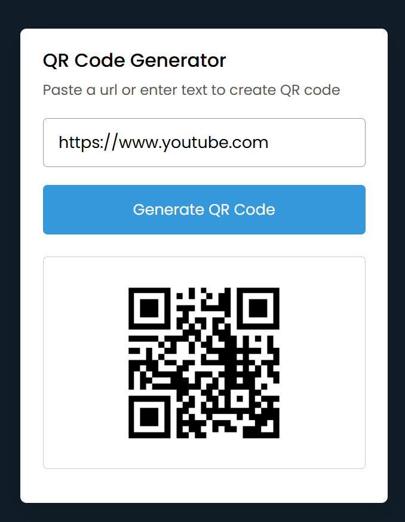
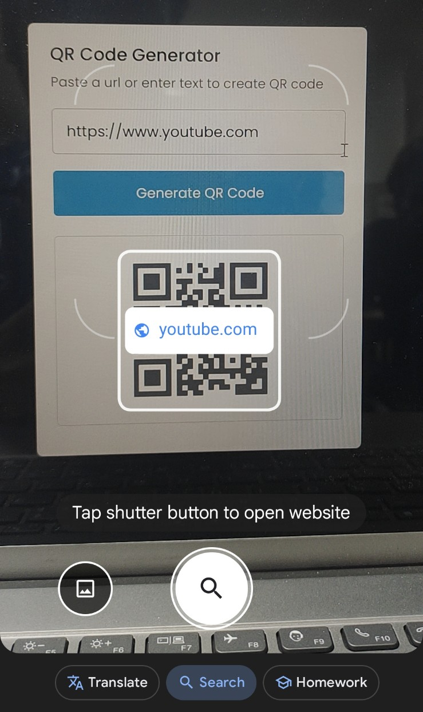

[](https://github.com/neonite2217)
[](https://github.com/neonite2217?tab=repositories)

# QR Code Generator

## 🛠️ Description

The **QR Code Generator** is a simple yet powerful web application that allows users to generate QR codes from any URL or text input. With just a few clicks, the app transforms your data into a scannable QR code, making it easy to share URLs, contact details, or any other text-based information.

This project demonstrates the power of **JavaScript** and **HTML5** in creating dynamic web applications, and the use of an external **QR Code API** to generate the actual QR codes.

## ⚙️ Technologies Used

This project is built with the following technologies:

- **HTML5** for structuring the webpage.
- **CSS3** for styling the layout and ensuring a responsive design.
- **JavaScript** for handling the QR code generation logic.

## 🌟 Features

- **Generate QR Codes**: Users can input text or URLs, and the app generates a scannable QR code.
- **Customization Options**: Allows users to change the text that will appear in the QR code.
- **Simple Interface**: The clean design makes it easy for users to input their data and generate QR codes instantly.
- **Downloadable QR Codes**: Users can download the generated QR code as an image file for sharing.

## 📺 Demo

<p align="center">



## 🚀 How to Run the Project Locally

Follow these steps to run the project on your local machine:

1. Clone the repository to your local machine:

```bash
git clone https://github.com/neonite2217/qr-code-generator.git
```

2. Navigate to the project directory:

```bash
cd QR-code generator
```

3. Open the `index.html` file in your browser to start generating QR codes.


## 💻 Example Usage

1. Open the project in your browser.
2. Input a URL or text into the provided field.
3. Click the **Generate QR Code** button.
4. The generated QR code will appear on the page, which can be scanned by any QR code scanner.
5. You can download the QR code as an image by clicking the download button.

## 🤖 Author
[Biswaketan](https://github.com/neonite2217/).
