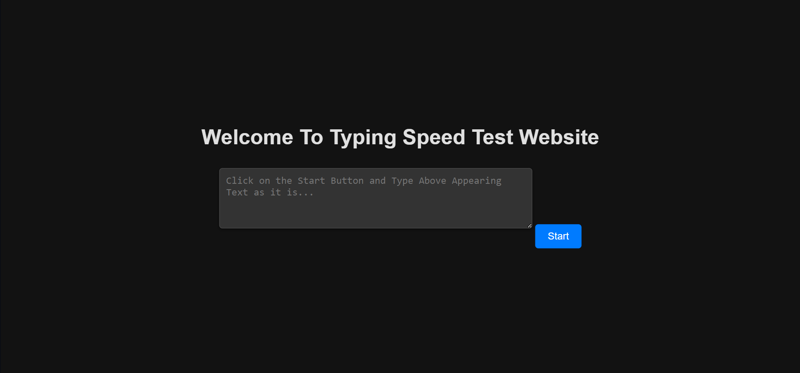

[](https://github.com/neonite2217)
[](https://github.com/neonite2217?tab=repositories)

# Typing-speed-test

## 🛠️ Description
The **Typing Speed Test** is a web-based application designed to test your typing speed and accuracy.
Users are presented with random text, and the goal is to type it as quickly and accurately as possible. 
At the end of the test, your typing speed (words per minute) and accuracy will be displayed, helping you improve your typing skills over time.

## ⚙️ Languages or Frameworks Used
<ul>
    <li>HTML5</li>
    <li>CSS3</li>
    <li>JavaScript</li>
</ul>

## 🌟 How to run the script
Running this game is easy.
Clone the Repository

```sh
git clone https://github.com/neonite2217/Web_Dev-2.0.git
```
Navigate to the project directory and run `index.html` file in your web browser

## 📺 Demo
<p align="center">


## 🤖 Author
[Biswaketan](https://github.com/neonite2217/)
